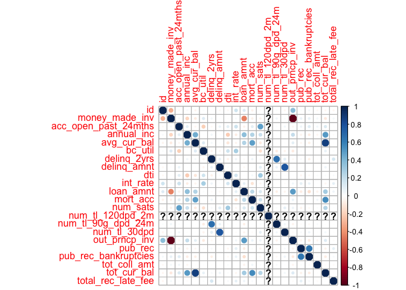
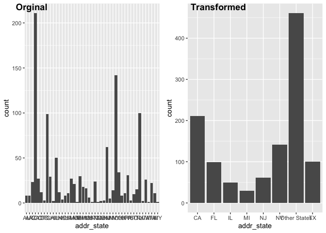
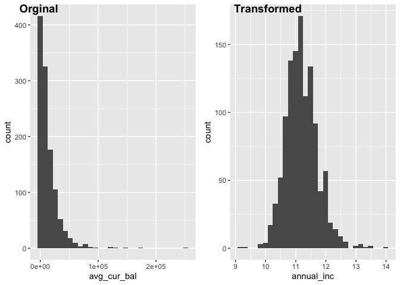
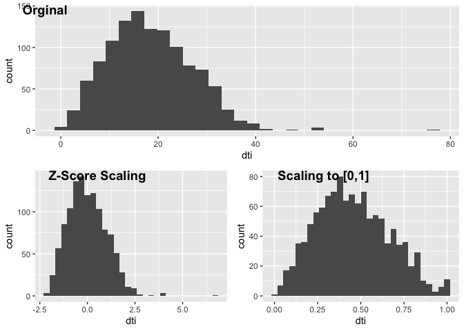
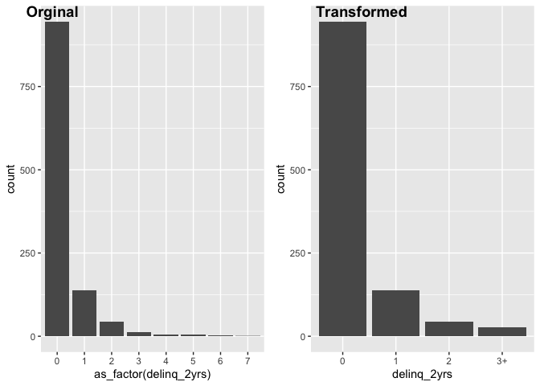

## Check Co-linearity

<!-- -->

## Transforming Categorical Variables: `addr_states`

For categorical predictors that has many categories but with vastly different frequencies such as `addr_states` can transformed to be more useful predictors by assigning categorical "outliers" as Out of Vocab (OOV) category. This way, the model would not waste time training on each rare categories separately.

<!-- -->

## Transforming Numerical Variables: `avg_cur_bal`

For numerical variables that represent monetary values such as `annual_inc` and `avg_cur_bal`, for the average current balance of all accounts, the data is often highly skewed with extreme values. Here I will transform these numerical values by log-scaling such that the distribution of data is more normalized and the skewness of large values is removed.

<!-- -->

## Transforming Numerical Variables: `dti`

Other numerical variables such as `dti` also contains outliers but the original distribution is much more normalized and values are less extreme. For these variables, I first apply z-score scaling to represents the number of standard deviations away from the mean. However, from the result shown, the extreme values have a sd of > 6. To compare with the clipping method, I arbitary set the maximum value of the variable to a more reasonable value such as 40 in this case. Then I scaled to range of [0,1] to compare the two transformations However, I chose to scale the variable using z-scores without clipping because I want to capture these feature values in models.

<!-- -->

## Transforming Numerical Variables: `delinq_2yrs`

For other numerical variables that have many discrete numerical values such as `delinq_2yrs`, I would arbitary clipped the maximum value as 3, which in itself is a rare category, and assign values equal to or larger than 3 as 3+. Finally, I would turn this variable into ordered categorical variables for modeling.

<!-- -->
