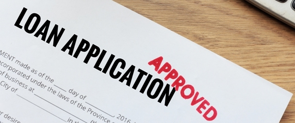

# Predict the money made on loans issued by a bank - STAT301-3 Regression Competition

This GitHub Repo is a place to present my work for Northwestern University STAT301-3 (Spring 2020) regression competition.

### Data Source: [STAT 301-3 Regression 2020: Bank Loans (Kaggle)](https://www.kaggle.com/c/nustat3013reg)

<!-- -->

This data was published on Kaggle (2020) for the purpose of employ the skills and techniques students have learned in class and build a model to predict the amount of money made on loans issued by a bank. To collect this data, I will simply download from the Kaggle website which contains a 2 csv files of training and testing datasets with ~8k and ~4k observations of 35 attributes. The training data consists of loan applications, including information on the applicants themselves, as well as the amount of money made off of each application. Fortunately, the data has no missing values needed to be handled. The target variable for this competition is `money_made_inv`, which is the money made by the bank on a loan. By doing this project, I hope to explore how banks make money from loans and what information or qualities about the applicants in the loan application is more likely to result in more profits for the banks.

I will first approach this dataset by conducting a brief [Exploratory Data Analysis](https://github.com/mataiscat/STAT301-3-regression/tree/master/EDA) on the team statistics using 20% of the training dataset. Then using the initial analysis, I will begin the data cleaning and wrangling process to standardize the non-numeric features and address with potential data issues mentioned in the next section below. Finally, after data cleaning, I will proceed to the model building process trying different regression algorithms and compare their performance in predicting our target using root mean square error.

### What banks look for when reviewing loan applications

To start this project, I need to understand what banks look for when approving a loan application in the first place. Banks typically make money from charging interest from loans as well as service/account fees. Depending on different types of loans, banks typically look at the applicant's credit score, which tells the bank information about the his/her credit history and utilization. The applicant's full financial profile is also important. For example, the applicant's income is used to calculated the debt-to-income ratio, which evaluates the applicant's ability to pay his/her obligations every month. The amount of down payment and loan term are also important when approving the applicant and setting the interest rate.

### Potential Data Issues

From a brief skimming through the datasets, there are some potential cleanings that need to be done on the data:
1. Many monetary predictors such as annual income `annual_inc` and the remaining outstanding principal of the loan `out_prncp_inv` etc. are highly skewed. I will handle this by taking log of the values.
2. Many categorical predictors that should be change to factor types instead of character. There are also some categorical variables with different levels in the training and testing dataset. I need to convert them to categorical with a common set of levels to avoid conflicts.
3. Some datetime predictors `last_credit_pull_d` when LC recently pulled credit for this loan and `earliest_cr_line` of the month the borrower's earliest reported credit line was opened can be turned into more useful information by finding how many days between most recent activity or the open account from now.
4. There are some unbalanced predictor information such as the application's state of address, his/her job title, and the loan sub-grade in which he/she is assigned. These categorical predictors tend to have many levels and tells little information.
5. Finally, I hope to reduce number of features by handling predictor issues above and trim down the dimension of the dataset before model fitting.
